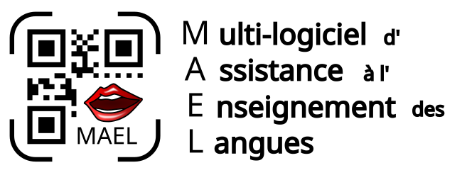
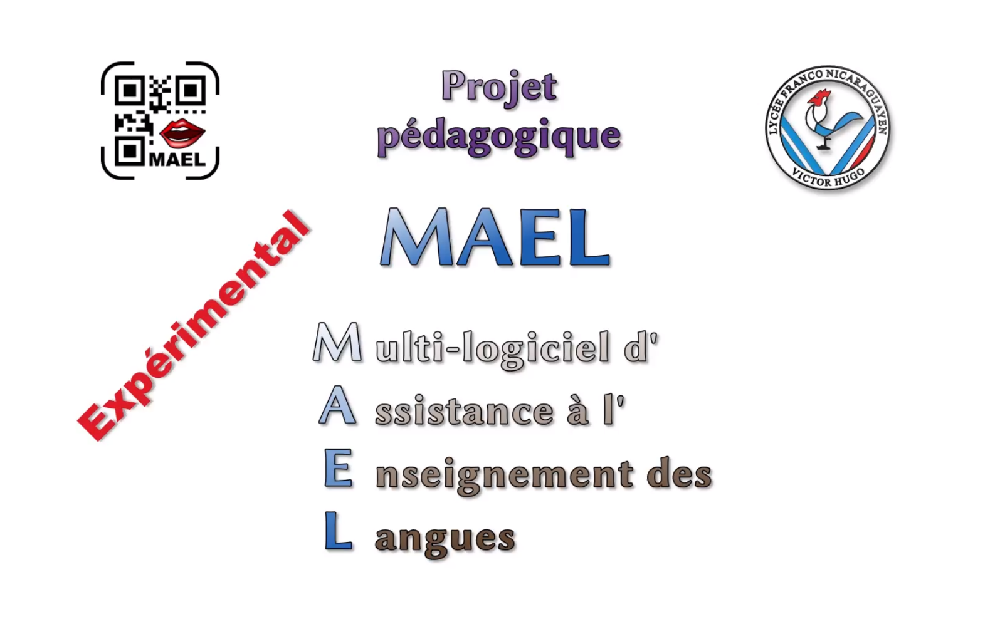
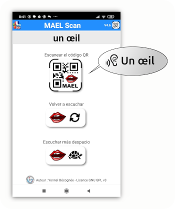
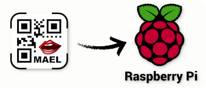
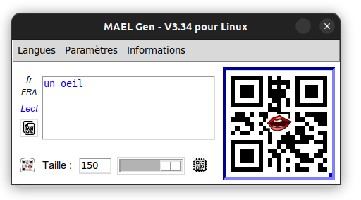
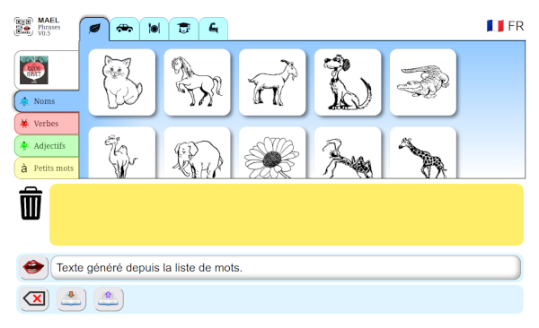
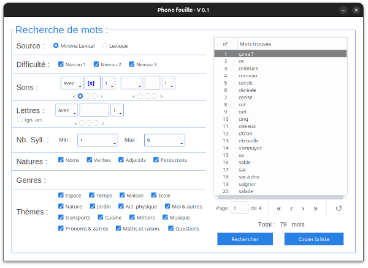

**Autor**: Yonnel Bécognée, maestro   
**Coautor**: François Varlet

## :fr: [Français](https://github.com/Yobeco/MAEL_Project/blob/main/README.fr.md) | :es: Español | :gb: [English](https://github.com/Yobeco/MAEL_Project/blob/main/README.md)

---

# I- Historia del proyecto :book:

## A- Génesis :milky_way:

Soy maestro en una escuela francesa en Managua (Nicaragua). Enseño en jardín de infancia o primaria, según el año. No todos mis estudiantes hablan francés (todavía), pero lo más importante es que algunos estudiantes no tienen padres francófonos en casa que los ayuden.

Siendo autodidacta en programación, tuve la idea de poner texto plano en un código QR para que pudiera ser escaneado y luego leído en voz alta por una pequeña aplicación móvil: **MAEL Scan**, creada con [Mit App Inventor](https://appinventor.mit.edu/) (Scratch para Android).

Así que añadí códigos QR (creados con un generador en línea) a los materiales educativos que los niños llevaban a casa.

:tada: :sparkles: Finalmente podían escuchar palabras o frases cortas en francés en casa. Esto resultó muy útil para su aprendizaje y me motivó a mejorar el sistema.

## B- Evolución :chart_with_upwards_trend:

Poco a poco, MAEL se ha convertido en una herramienta útil para varios profesores de idiomas. Actualmente, lo utilizo todos los días con mis alumnos de segundo y tercer grado.

* Así que creé un pequeño generador de códigos QR llamado **MAEL Gen** (Python), más práctico que un sitio web.
* Añadí un modo "Dictar" que oculta el texto leído por MAEL Scan.
* Añadí un modo "Deletrear" que deletrea las letras en lugar de leer el texto.
* Añadí un cifrado ligero del contenido del código QR (para los listillos que usan un lector de códigos QR estándar para preparar su dictado :stuck_out_tongue_winking_eye: ).
* Mantengo la opción de usar 55 idiomas (al menos para los modos de lectura y dictado por ahora).

Además, inspirado por un colega, comencé a desarrollar una aplicación en JavaScript que permite a los usuarios crear frases de manera autónoma a partir de imágenes.

Este fue el nacimiento de **MAEL Phrase**.

_Pequeño video que resume el estado actual del proyecto MAEL:_

## C- Perspectivas :eyes:

 :fire: Actualmente varias tareas son urgentes:

- **MAEL Scan** requiere una versión **iOS** porque hay varios usuarios que tienen un iPhone (ya iniciada en Kotlin).

- **MAEL Phrase** es solo una página pequeña y limitada (entre otras cosas, no usa Gemini 2.5). Necesita convertirse en una verdadera **plataforma con seguimiento de las actividades de los estudiantes**.

- **MAEL Scan** para primaria sigue siendo otra oportunidad para que el niño tenga un teléfono en la mano. Por eso comencé a desarrollar una versión que funcione en un **Raspberry Pi**.

:keyboard: Lista de desarrollos en curso:

| Aplicación | Repositorio GitHub |
| ----------- | ----------- |
| MAEL Scan | [Disponible](https://github.com/Yobeco/MAEL_Scan) |
| MAEL Scan Pi | Próximamente disponible |
| MAEL Gen | [Disponible](https://github.com/Yobeco/MAEL_Gen) |
| MAEL Phrase | [Disponible](https://github.com/Yobeco/MAEL_Phrases) |
| Phonofouille | [Disponible](https://github.com/Yobeco/MAEL_Phonofouille) |

## D- Conclusión :checkered_flag:

### :man_teacher: Solo soy un maestro que se enseñó programación a sí mismo.

Además de mi trabajo en el aula (preparación, correcciones, etc.), ya no tengo suficiente tiempo para formarme y seguir desarrollando el proyecto MAEL al ritmo que requiere.

### **¡MAEL me sobrepasa!** :sweat_smile:

* :trophy: MAEL Scan se está utilizando actualmente **en varias aulas de América Central y Norte**, donde los profesores sugieren mejoras.
* :postal_horn: El proyecto está **apoyado por la Zona AMLA Norte** (nuestra academia regional) y sus asesores educativos. Pero no puedo seguir el ritmo: desarrollo de Raspberry Pi, creación de la plataforma, versión iOS de MAEL Scan, mejora de MAEL Gen...

### **:rescue_worker_helmet: Para esto, decidí fundar una comunidad OpenSource.**

* Para suplir mis carencias.
* Para acelerar el desarrollo de esta aplicación, que puede permitir a muchos estudiantes (niños y adultos) aprender un nuevo idioma. :grin:

:fr: :gb: :es: :portugal: :brazil: :it: :de: :ru: :jp: :cn: :kr: ...

---

# II- Aplicaciones del proyecto MAEL :gear:

## A- MAEL Scan :iphone:

Esta es la primera aplicación creada.

:speaking_head: Permite a los estudiantes escuchar el contenido de un código QR colocado en un documento en papel por el profesor.

El código QR puede contener:

* :page_facing_up: **una palabra o un texto** que será leído por una voz sintética, o
* :microphone: un enlace a **un archivo .mp3** :musical_note: (actualmente alojado en Google Drive).

---

### 1- MAEL Scan - Versión con App Inventor :child:

La primera versión de **MAEL Scan** se desarrolló con [MIT App Inventor](https://appinventor.mit.edu/) (programación por bloques).  
Esto permitió crear rápidamente una versión funcional. Sin embargo, este lenguaje es insuficiente para desarrollos futuros.

Por otro lado, solo es posible compilar para Android. Por ello, varias familias compraron un teléfono Android básico para poder usar MAEL. :unamused:

---

### 2- MAEL Scan - Versión Kotlin :green_apple:

[Kotlin MP](https://kotlinlang.org/) está diseñado para permitir la creación de aplicaciones para múltiples plataformas a partir de un único código fuente.

Para superar las limitaciones impuestas por el lenguaje MIT App Inventor y poder crear una **versión iOS de MAEL**, comencé a aprender Kotlin. (Pero también para desarrollar el back-end de MAEL Phrase)

Por el momento, solo se ha codificado la interfaz. Actualmente estoy atascado con la implementación del módulo de lectura de códigos QR y del módulo de síntesis de voz.

---

### 3- MAEL Scan - Versión sin teléfono :no_mobile_phones:

Siendo consciente de los problemas que plantea **el uso excesivo del teléfono móvil entre los niños pequeños**, pronto me sentí culpable de poner uno en manos de niños de preescolar y primaria.

:bulb: Así que comencé a desarrollar una versión de MAEL Scan (Python) en una placa **Raspberry Pi** equipada con pantalla E-paper. Un primer prototipo ya funciona.

Se prevé que "MAEL Scan Pi" (nombre provisional) se convierta en un atractivo objeto impreso en 3D prestado a las familias, símbolo tangible de su entrada en un nuevo aprendizaje.

[Aún sin repositorio](./readme_assets/GitHub-H_constr_45px.png)

---

## B- MAEL Gen :computer:

**MAEL Gen** fue desarrollado (Python) para facilitar la **creación de códigos QR** por parte del profesor.  
Funciona en ordenadores (Linux/MacOS/Win) y permite configurar fácilmente el contenido de los códigos QR añadiendo de manera transparente las etiquetas necesarias.

---

## C- MAEL Phrase :globe_with_meridians:

### 1- La aplicación de creación de frases :speaking_head:

**MAEL Phrase** tiene como objetivo permitir al estudiante **crear frases de manera autónoma**.  
Programado en HTML/JavaScript/CSS, utiliza por el momento la API gratuita (pero limitada) de `Gemini 2.5 Pro` para generar frases conjugadas y acordadas.

Se espera que el profesor pueda diseñar sus propias actividades personalizadas para los estudiantes de su clase.

### 2- Phonofouille :mag_right:

**MAEL Phrase** ofrecerá por defecto un banco de palabras (y de imágenes) que el profesor podrá enriquecer a su gusto.

Para crear sus propias actividades, el profesor necesitará un **motor de búsqueda** para seleccionar palabras de la base de datos.  
:bookmark_tabs: Sin embargo, criterios como buscar por sonidos, posición del sonido en la palabra, tipo de palabra, tema o número de sílabas serían muy útiles.

:bulb: Así que desarrollé **Phonofouille** (Python/SQLite) para explorar la viabilidad de un motor de búsqueda de este tipo.

---

# III- ¡Participa en el proyecto MAEL!

Escríbeme a esta dirección para más detalles:

### 📨 ***[mael@lvh.edu.ni](mailto:mael@lvh.edu.ni)***

Necesitamos colaboradores que tengan:

* Habilidades en Python,
* Dominio de Raspberry Pi y gestión de módulos,
* Habilidades en Kotlin (backend),
* Habilidades en Kotlin MP (Android e iOS),
* Habilidades en HTML/JavaScript/CSS,
* Habilidades en PostgreSQL.
* :pencil2: También necesitamos un(a) ilustrador(a) para crear una **biblioteca de imágenes libres de derechos** para MAEL Phrase.
* Conocimientos en macros de LibreOffice 

---