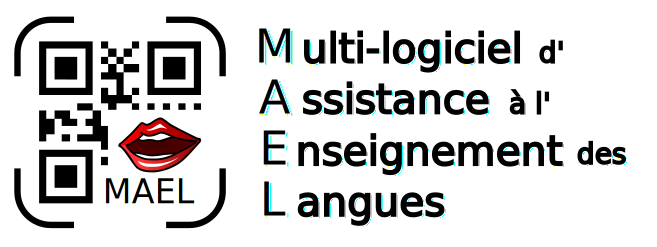
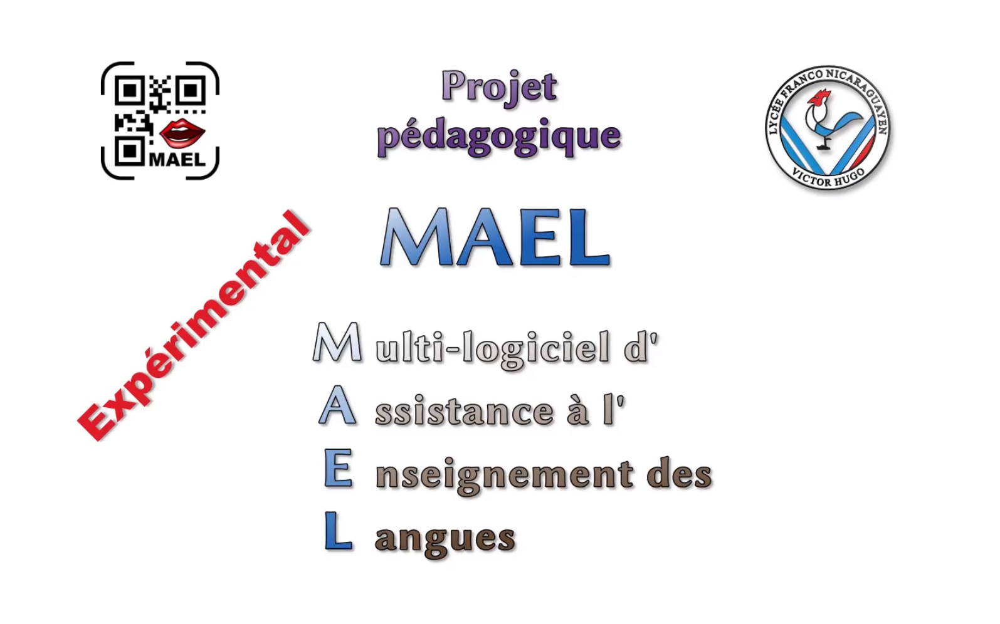
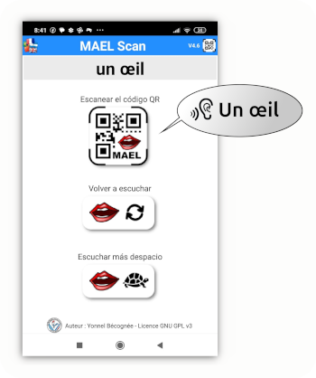
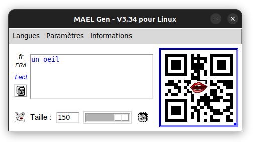
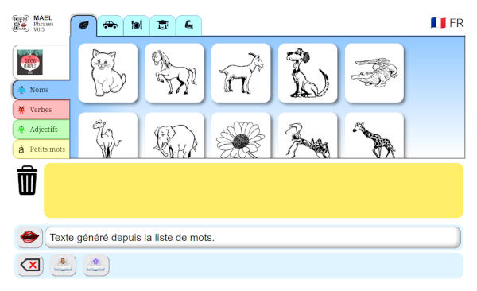
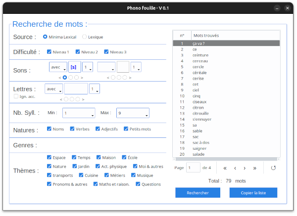

**Auteur** : Yonnel Bécognée, instituteur  
**Co-auteur** : François Varlet

:fr: Présentation du projet MAEL

:gb: Presentation of the MAEL project

# I- Histoire du projet :book:

## A- Génèse :milky_way:

Je suis instituteur dans une école française à Managua (Nicaragua :nicaragua:). J'enseigne en maternelle ou en élémentaire selon les années. Tous mes élèves ne parlent pas (encore) français, mais surtout, certains élèves n'ont aucun parent francophone à la maison pour les aider.

Étant autodidacte en programmation, j'ai eu l'idée de mettre du texte brut dans un code QR afin de le faire scanner puis oraliser par une petite application pour cellulaire : **MAEL Scan**, créé avec [Mit App Inventor](https://appinventor.mit.edu/) (Scratch pour Android).

J'ai donc ajouté des codes QR (créés avec un générateur en ligne) aux supports pédagogiques que les enfants rapportaient à la maison. 

:tada: :sparkles: Ils pouvaient enfin écouter des mots ou de courtes phrases en français chez eux. Cela s'est montré très utile pour leur apprentissage et m'a donné l'envie d'améliorer le système.

## B- Évolution :chart_with_upwards_trend:

Petit à petit, MAEL est devenu un outil utile pour plusieurs professeurs enseignant une langue. Personnellement, je l'utilise tous les jours.

- J'ai donc créé un petit générateur de codes QR **MAEL Gen** (python) plus pratique qu'un site web.
- J'ai ajouté un mode "Dicter" qui cache le texte lu par MAEL Scan.
- J'ai ajouté un mode "Épeler" qui épelle les lettres au lieu de lire le texte.
- J'ai ajouté un encryptage léger du contenu du code QR (pour les petits malins qui utilisent un lecteur de code QR standard pour préparer leur dictée :stuck_out_tongue_winking_eye: )
- J'ai maintenu la possibilité d'utiliser 55 langues (au moins pour les modes lecture et dicter pour le moment).

Par ailleurs, sous l'inspiration d'un collègue, j'ai commencé à développer une application en JavaScript, qui permet de créer des phrases en toute autonomie à partir d'images.

Ce fut la naissance de **MAEL Phrase**.

*Petite vidéo résumant où en est le projet MAEL actuellement :*

## C- Prospective :eyes:

:fire: Plusieurs travaux sont urgents actuellement :

1- **MAEL Scan** nécessite une version **iOS** car il y a pas mal d'utilisateurs qui ont un iPhone (déjà commencée en Kotlin).

2- **MAEL Phrase** n'est qu'une petite page limitée (entre autre pas l'usage de Gemini 2.5). Elle a besoin de devenir une véritable **plateforme avec suivi des activités des élèves**.

3- **MAEL Scan** pour le primaire, reste une occasion de plus pour l'enfant d'avoir un téléphone dans la main. J'ai donc commencé le développement d'une version embarquée sur un **Raspberry pi**.

### :keyboard: Liste des développements en cours :

| Application | Dépôt GitHub |
| ----------- | ----------- |
| MAEL Scan | [Disponible](https://github.com/Yobeco/MAEL_Scan) |
| MAEL Scan Pi | Bientôt Disponible |
| MAEL Gen | [Disponible](https://github.com/Yobeco/MAEL_Gen) |
| MAEL phrase | [Disponible](https://github.com/Yobeco/MAEL_Phrases) |
| Phonofouille | [Disponible](https://github.com/Yobeco/MAEL_Phonofouille) |

## D- Conclusion :checkered_flag:

### :man_teacher: Je ne suis qu'un instit qui s'est auto-formé en programmation.  
En plus de mon travail de classe (préparation, corrections...) je ne trouve plus assez de temps pour me former et continuer à développer le projet MAEL à la vitesse qu'il requière.

### **MAEL me dépasse !** :sweat_smile:

- :trophy: MAEL Scan est actuellement **en cours d'utilisation dans plusieurs classes en Amérique centrale et du nort** dont les professeurs me proposent des améliorations.

- :postal_horn: Le projet est **soutenu par la Zone AMLA Nord** (Académie de notre région) et ses conseillés pédagogiques. Mais je n'arrive pas à suivre le rythme : développement raspberry pi, création de la plateforme, version iOS de MAEL Scan, amélioration de MAEL Gen...

### **:rescue_worker_helmet: Pour cela, j'ai décidé de fonder une communauté OpenSource.**

- Pour suppléer mes lacunes. 
- Pour accélérer le développement de cette application qui peut permettre à de nombreux élèves (enfants & adultes) d'apprendre une nouvelle langue. :grin:

:fr: :gb: :es: :portugal: :brazil: :it: :de: :ru: :jp: :cn: :kr: ...

---

# II- Les applications du projet MAEL :gear:

---

## A- MAEL Scan :iphone:

C'est la première application créée. 

:speaking_head: Elle permet aux élèves d'écouter le contenu d'un code QR mis sur un document papier par le professeur.

Le code QR peut contenir :

- :page_facing_up: **un mot ou un texte** qui sera lu par une voix de syhtèse ou bien 
- :microphone: un lien vers **un fichier .mp3** :musical_note: (pour le moment hébergé sur un Google Drive).

---

### 1- MAEL Scan - Version Mit App Inventor :child:

La première version de **MAEL Scan** a été développée avec [MIT App Inventor](https://appinventor.mit.edu/) (code par blocks).   
Cela a permis de créer rapidement une version fonctionnelle. Cependant, ce langage est inssuffisant pour les développements futurs. 

D'autre part, seule une compilation pour Android est possible. Alors, plusieurs  familles ont acheté un téléphone Android basique pour pouvoir utiliser MAEL. :unamused:

---

### 2- MAEL Scan - Version Kotlin :green_apple:

[Kotlin MP](https://kotlinlang.org/) est conçu pour pouvoir créer une application pour plusieurs plateformes à partir d'un même code source.

Pour dépasser les limites imposées par le langage MIT App Inventor et pour pouvoir créer une **version iOS de MAEL**, j'ai donc commencé à apprendre le Kotlin. (Mais aussi pour développer le back-end de MAEL Phrase)

Pour le moment, seule l'interface a été codée. Je suis actuellement bloqué concernant l'implémentation du module de lecture de code QR et l'implémentation du module pour la synthèse vocale.

### En savoir plus : 
---

### 3- MAEL Scan - Version sans téléphone :no_mobile_phones:

Étant conscient des problèmes que pose **l'utilisation excessive du téléphone portable chez les plus jeunes**, j'ai vite eu des remords à en mettre un dans les mains d'enfants de materelle et d'école élémentaire.

:bulb: J'ai donc commencé à développer une version de MAEL Scan (Python) sur une carte **Raspberry pi** équipée d'un écran E-paper. Un premier prototype est déjà fonctionnel.

Il est prévu que "MAEL Scan Pi" (nom provisoire) devienne un bel objet imprimé en 3D prêté aux familles, symbole matériel de leur entrée dans un nouvel apprentissage.

:construction:  :construction:

---

## B- MAEL Gen :computer:

**MAEL Gen** fut développé (Python) pour faciliter la **création des codes QR** par le professeur.  
Il fonctionne sur ordinateur (Linux/MacOS/Win) et permet de paramétrer facilement le contenu des codes QR en ajoutant de manière transparente les balises nécessaires.

  :brain: [En savoir plus sur MAEL Gen](https://github.com/Yobeco/MAEL_Gen) :brain: 

---

## C- MAEL Phrase :globe_with_meridians:

### 1- L'application de création de phrases :speaking_head:

**MAEL Phrase** a pour objectif de permettre à l'élève de **créer des phrases de manière autonome**.
Programmé en HTML/JavaScript/CSS, il utilise pour le moment l'API gratuite (mais limitée) de `Gemini 2.5 Pro` pour générer des phrases conjuguées et accordées.

Il est prévu que le professeur puisse concevoir ses propres activités sur mesure, pour les élèves de sa classe.

 :brain:  [En savoir plus sur MAEL Phrases](https://github.com/Yobeco/MAEL_Phrases) :brain: 

### 2- Phonofouille :mag_right:

**MAEL Phrase** va proposer par défault une banque de mots (et d'images) que le professeur pourra enrichir à sa guise.

Afin, de créer ses propres activités, le professeur aura besoin d'un **moteur de recherche** pour choisir des mots dans la base de données.  
:bookmark_tabs: Cependant, des critères tels que le recherche par sons, position du son dans le mot, par nature du mot, par thèmes ou par nombre de syllabes serait très utile.

:bulb: J'ai donc développé **Phonophouille** (python/SQLite) afin d'explorer la faisabilité d'un tel moteur de recherches.

   :brain: [En savoir plus sur Phonofouille](https://github.com/Yobeco/MAEL_Phonofouille) :brain: 

---

# III- Participez au projet MAEL !

Écrivez-moi à cette adresse pour plus de détails :

***[mael@lvh.edu.ni](mailto:mael@lvh.edu.ni)***

Nous avons besoin de contributeurs ayant :

- des compétences en python,
- la maîtrise du Raspberry pi et la gestions de modules,
- des compétences en Kotlin (Backend),
- des compétences en Kotlin MP (Android et iOS),
- des compétences en HTML/JavaScript/CSS,
- des compétences en PostgreSQL.
- :pencil2: Nous avons également besoin d'un(e) illustrateur / illustratrice pour créer une **bibliothèque d'images libres de droits** pour MAEL Phrase.

---

